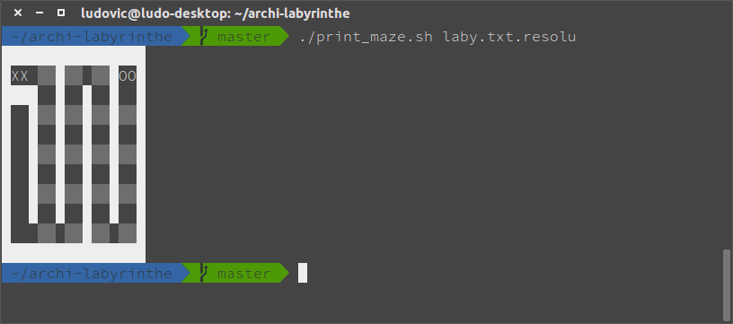

# Génération et résolution de labyrinthe

Projet réalisé dans le cadre de l'UE "Architecture des ordinateurs" lors du troisième semestre de licence d'informatique.  
Ce projet a été réalisé par Eloise Stein et Ludovic Muller.  
Le code a été réalisé en assembleur MIPS et doit être exécuté avec l'émulateur MARS.

## Génération d'un labyrinthe

Supposons que vous ayez un alias `mars` qui permet de lancer l'émulateur MARS depuis votre terminal.  
Pour lancer le code, il vous suffira d'éxécuter la commande `mars projet.s`.  
Il vous sera alors demandé un nom de fichier (sans l'extension); entrez ce que vous souhaitez (seule contrainte, la longueur maximale est de 1013, mais normalement cela ne devrait pas poser de soucis :wink: )  
Un menu va appraître. Tappez `1` afin de générer un labyrinthe.  
Puis on va vous demander d'entrer un nombre N compris entre 2 et 99; ce nombre correspond au nombre de lignes/colonnes que vous souhaitez pour votre labyrinthe, puis validez avec la touche `Entrée`.  
Normalement un message vous disant que le fichier contenant le labyrinthe généré a bien été créé va s'afficher à l'écran.

## Affichage d'un labyrinthe

Vous pouvez ouvrir le fichier qui a été créé avec l'aide d'un éditeur de texte, mais vous constaterez qu'il ne s'agira que d'une suite de nombres.  
Pour un affichage plus lisible, vous pouvez utiliser le script `print_maze.sh` fournit avec, et s'utilise de la manière suivante : `./print_maze.sh NOM_DU_FICHIER.txt`.

Exemple :

## Résolution d'un labyrinthe

Pour résoudre un labyrinthe, rien de plus simple. Procédez comme pour la génération, sauf que dans le menu il vous faudra entrer le choix `2` au lieu du choix `1`. Un message vous disant que le fichier `NOM_DU_FICHIER.txt.resolu` a bien été créé va s'afficher à l'écran.

## Affichage de la solution d'un labyrinthe

Procédez comme pour l'affichage d'un labyrinthe généré en ajoutant `.resolu` à votre nom de fichier `.txt`.

Exemple :

## Ressources

- http://courses.missouristate.edu/KenVollmar/mars/ pour télécharger l'émulateur MARS
- http://courses.missouristate.edu/kenvollmar/mars/help/syscallhelp.html pour avoir la documentation pour MIPS et les différents appels système
